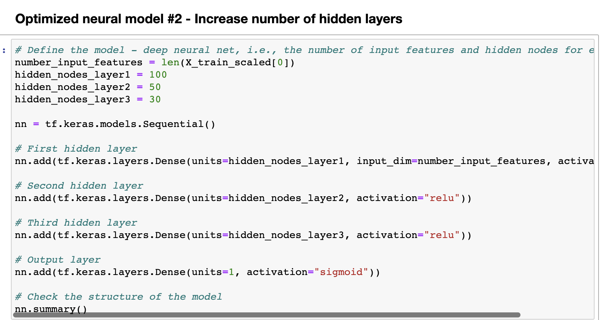

# Charity Analysis using Neural Networks

## Overview of the analysis:
The purpose of this analysis is to use neural networks and deep learning to create an algorithm that will predict whether charity applicants will be successful if funded by Alphabet Soup. The algorithm will make predictions based on features including classification, use case, organization, income amount, etc. 

## Results
*Data Preprocessing*
* What variable(s) are considered the target(s) for your model? 
The target for this model is the `IS_SUCCESSFUL` column.

* What variable(s) are considered to be the features of your mode? 
The features are `APPLICATION_TYPE`, `AFFILIATION`, `CLASSIFICATION`, `USE_CASE`, `ORGANIZATION`, `STATUS`, `INCOME_AMT`, `SPECIAL_CONSIDERATIONS`, AND `ASK_AMT`. 

* What variable(s) are neither targets nor features, and should be removed from the input data? 
Identification features that offer no advantageous information for the model were removed. These include the `EIN` and `NAME` columns. 

*Compiling, Training, and Evaluating the Model*
* How many neurons, layers, and activation functions did you select for your neural networks, and why?
The original model has an input layer, two hidden layers, and an output layer. The the first hidden layer has 80 nodes/neurons and the second has 30. A general rule of thumb for building neural networks is to have two to three times the amount of neurons in the hidden layer as the number of inputs. The input layer is the length of our `X_train_scaled` which is 43. Following this rule, the first hidden layer has 80 nodes. We used the `relu` activation function because our feature data is nonlinear. 

* Were you able to achieve the target model performance?
The target accuracy for this model was 75%. I was unable to alter the model in a way to achieve a 75% accuracy. The lowest accuracy I achieved was 72.0% and the highest accuracy was 72.7%. 

* What steps did you take to try and increase model performance?
I made three attempt to increase the model's performance. 
In the first attempt, I added more neurons to the hidden layers. Since the basic rule of thumb says to use two to three times of neurons on the hidden layer as the input features. Our original model used 80 nodes, which is about double. To optimize the model, I reran it with 120 (three times the number of input features) neurons. The original model received an accuracy score of 72.58%. The first attempt to optimize the model resulted in a slightly lower accuracy of 72.54%. 

 
The second attempt to optimize the model involved increasing the number of hidden layers. I added an extra hidden layer. The first hidden layer had 100 nodes, the second 50 nodes, and the third 30 nodes. This attempt resulted in a slightly higher accuracy score of 72.64%. 

 
The final attempt to optimize the model focused on preprocessing the data. I looked at `INCOME_AMT` and noticed that the majority of applicants had a recorded income of 0. It's unclear whether these applicants actually have 0 income, are non-profits that record earnings differently, did not report/include income information. I removed both the `SPECIAL_CONSIDERATIONS` and `STATUS` columns after looking at the `value_counts()` and noticed that there was an uneven distribution of values. Thinking this may have an influence on the model's performance, I removed the columns to see how the model would work. I used the same model construction as the optimization 2 attempt (three hidden layers) since it performed the best. This model performed the worst with an accuracy of 72.04%. 

 

## Summary
Deep learning is not straight-forward. There are many different types of factors to consider to build the best model for the desired purpose. Performance of the model is also context-dependent. If the model is making high-stake predictions that may impact health and safety decisions, a higher accuracy is required in order to make a reliable model. On the other hand, when models are used to make recommendations or other low-stake predictions, a lower accuracy is acceptable. Planning and applying your understanding of neural network to build the best model is a priority. But to an extent, fine-tuning the model can be trial and error. A model's performance can also be dependent on the data. If the data has a lot of outliers, missing data, or does not have sufficient information for the model to train. For example, in this dataset the income is provided in a range. Some ranges vary greatly such as 10 million to 50 million. I would recommend looking at the data and changing how some information is recorded. Perhaps, binning the income amounts in an attempt to standardize the information could improve the model's classification accuracy. 
